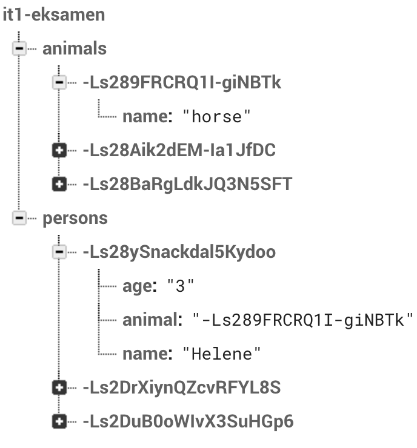

# IT1
[Se nettsiden live](https://emlie.github.io/it1/)
<br><br>
Til muntlig-praktisk eksamen i IT1 skal det leveres et produkt som inneholder en database og et dynamisk nettsted, som vil si at nettsiden skal koble seg opp mot databasen. Nettstedet skal kunne hente ut, legge inn, slette og oppdatere data i databasen.
<br><br>
Denne nettsiden kan sees på som en helt enkel fasit med det mest nødvendige av kode.
<br><br>
## Databasen i Firebase

<br><br>
## Kommentarer til koden
**Noen forkortelser forklart**<br>
* inp = input
* sel = select menu
* db = database
* ref = reference
<br><br>
Metoden som er brukt til å hente ut elementer fra DOM (HTML-elementer) er `querySelector('string')`, men det kan også gjøres på en annen måte (vist under).
```javascript
// Dette:
let formSendAnimal = document.querySelector('#formSendAnimal');

// er det samme som dette:
let formSendAnimal = document.getElementById('formSendAnimal');
```
